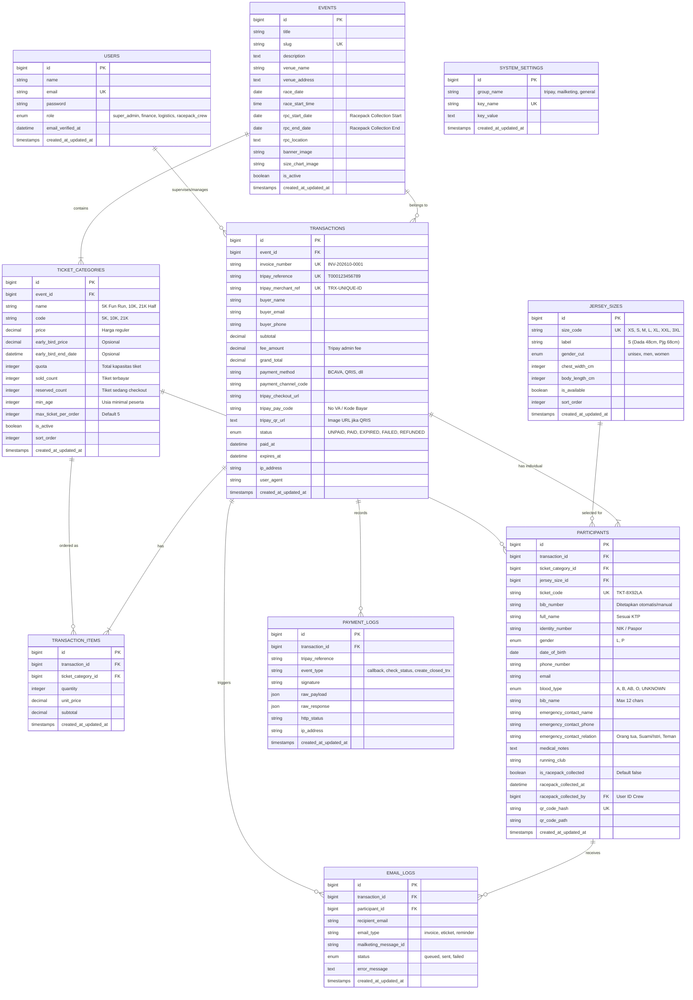

# Database Schema Specification
## Sistem Pendaftaran Event Lari (Laravel + MySQL/MariaDB)

---

## 1. Entity Relationship Diagram (ERD)



---

## 2. Rincian Skema Tabel (Data Dictionary)

### 2.1. Tabel `users`
Menyimpan data admin, staf keuangan, dan kru racepack collection.

| Kolom | Tipe Data | Nullable | Default | Keterangan |
|---|---|---|---|---|
| `id` | BIGINT UNSIGNED | No | Auto Increment | Primary Key |
| `name` | VARCHAR(100) | No | - | Nama lengkap staf/admin |
| `email` | VARCHAR(150) | No | - | Email unik login |
| `password` | VARCHAR(255) | No | - | Hashed password (Bcrypt/Argon2) |
| `role` | ENUM | No | `'logistics'` | `'super_admin'`, `'finance'`, `'logistics'`, `'racepack_crew'` |
| `remember_token` | VARCHAR(100) | Yes | NULL | Token Remember Me |
| `created_at` | TIMESTAMP | Yes | NULL | Waktu dibuat |
| `updated_at` | TIMESTAMP | Yes | NULL | Waktu diubah |

- **Indexes**: `PRIMARY (id)`, `UNIQUE (email)`.

---

### 2.2. Tabel `events`
Informasi utama event lari. Dirancang multi-event atau single-event yang fleksibel.

| Kolom | Tipe Data | Nullable | Default | Keterangan |
|---|---|---|---|---|
| `id` | BIGINT UNSIGNED | No | Auto Increment | Primary Key |
| `title` | VARCHAR(200) | No | - | Nama Event, cth: "Jakarta Sunset Run 2026" |
| `slug` | VARCHAR(200) | No | - | URL slug unik |
| `description` | TEXT | Yes | NULL | Deskripsi singkat & pengumuman |
| `venue_name` | VARCHAR(150) | No | - | Tempat pelaksanaan (cth: GBK Senayan) |
| `venue_address` | TEXT | Yes | NULL | Alamat lengkap lokasi start/finish |
| `race_date` | DATE | No | - | Tanggal pelaksanaan race lari |
| `race_start_time` | TIME | No | - | Jam flag-off start lari |
| `rpc_start_date` | DATE | Yes | NULL | Tanggal awal pengambilan racepack |
| `rpc_end_date` | DATE | Yes | NULL | Tanggal akhir pengambilan racepack |
| `rpc_location` | TEXT | Yes | NULL | Lokasi pengambilan racepack |
| `banner_image` | VARCHAR(255) | Yes | NULL | Path gambar header subdomain |
| `size_chart_image` | VARCHAR(255) | Yes | NULL | Path gambar panduan size jersey |
| `is_active` | BOOLEAN | No | `TRUE` | Status event aktif atau nonaktif |
| `created_at` / `updated_at` | TIMESTAMP | Yes | NULL | Timestamps |

- **Indexes**: `PRIMARY (id)`, `UNIQUE (slug)`, `INDEX (is_active, race_date)`.

---

### 2.3. Tabel `ticket_categories`
Kategori lomba (5K, 10K, Half Marathon, Full Marathon, dll) beserta harga dan kuota.

| Kolom | Tipe Data | Nullable | Default | Keterangan |
|---|---|---|---|---|
| `id` | BIGINT UNSIGNED | No | Auto Increment | Primary Key |
| `event_id` | BIGINT UNSIGNED | No | - | Foreign Key -> `events.id` (ON DELETE CASCADE) |
| `name` | VARCHAR(100) | No | - | Cth: "10K Open Category" |
| `code` | VARCHAR(20) | No | - | Kode singkat: "10K", "5K", "21K" |
| `description` | TEXT | Yes | NULL | Fasilitas tiket (Medal, Jersey, BIB, dll) |
| `price` | DECIMAL(12,2) | No | `0.00` | Harga reguler per tiket |
| `early_bird_price`| DECIMAL(12,2) | Yes | NULL | Harga early bird (jika ada) |
| `early_bird_end_date` | DATETIME | Yes | NULL | Batas waktu harga promo early bird |
| `quota` | INT UNSIGNED | No | `0` | Total kuota tiket kategori ini |
| `sold_count` | INT UNSIGNED | No | `0` | Jumlah tiket yang sudah lunas (PAID) |
| `reserved_count` | INT UNSIGNED | No | `0` | Jumlah tiket dalam proses bayar (Hold) |
| `min_age` | SMALLINT | No | `12` | Batasan usia minimum peserta |
| `max_ticket_per_order`| SMALLINT | No | `5` | Maksimal pembelian dalam 1 transaksi |
| `is_active` | BOOLEAN | No | `TRUE` | Apakah kategori ini ditampilkan |
| `sort_order` | INT | No | `0` | Urutan tampilan di frontend |
| `created_at` / `updated_at` | TIMESTAMP | Yes | NULL | Timestamps |

- **Indexes**: `PRIMARY (id)`, `INDEX (event_id, is_active)`, `INDEX (sort_order)`.

---

### 2.4. Tabel `jersey_sizes`
Master ukuran jersey yang diakomodir oleh pabrik/konveksi.

| Kolom | Tipe Data | Nullable | Default | Keterangan |
|---|---|---|---|---|
| `id` | BIGINT UNSIGNED | No | Auto Increment | Primary Key |
| `size_code` | VARCHAR(10) | No | - | "XS", "S", "M", "L", "XL", "XXL", "3XL" |
| `label` | VARCHAR(50) | No | - | Cth: "M (Lebar Dada 50cm, Pjg 70cm)" |
| `gender_cut` | ENUM | No | `'unisex'` | `'unisex'`, `'men'`, `'women'` |
| `chest_width_cm` | SMALLINT | Yes | NULL | Lebar dada dalam satuan cm |
| `body_length_cm` | SMALLINT | Yes | NULL | Panjang badan dalam satuan cm |
| `is_available` | BOOLEAN | No | `TRUE` | Stok ketersediaan ukuran di pabrik |
| `sort_order` | INT | No | `0` | Urutan dari ukuran terkecil ke terbesar |
| `created_at` / `updated_at` | TIMESTAMP | Yes | NULL | Timestamps |

- **Indexes**: `PRIMARY (id)`, `UNIQUE (size_code, gender_cut)`, `INDEX (sort_order)`.

---

### 2.5. Tabel `transactions`
Menyimpan transaksi pemesanan tiket dan status pembayaran Tripay.

| Kolom | Tipe Data | Nullable | Default | Keterangan |
|---|---|---|---|---|
| `id` | BIGINT UNSIGNED | No | Auto Increment | Primary Key |
| `event_id` | BIGINT UNSIGNED | No | - | Foreign Key -> `events.id` |
| `invoice_number` | VARCHAR(50) | No | - | Nomor invoice internal, cth: `INV-202610-0012` |
| `tripay_reference`| VARCHAR(60) | Yes | NULL | Nomor referensi unik dari Tripay |
| `tripay_merchant_ref` | VARCHAR(60) | No | - | Unique Merchant Ref kita ke Tripay |
| `buyer_name` | VARCHAR(120) | No | - | Nama orang yang melakukan pembayaran |
| `buyer_email` | VARCHAR(150) | No | - | Email penerima invoice & bukti bayar |
| `buyer_phone` | VARCHAR(30) | No | - | Nomor WhatsApp pembeli |
| `subtotal` | DECIMAL(12,2) | No | `0.00` | Total harga seluruh tiket |
| `fee_amount` | DECIMAL(12,2) | No | `0.00` | Biaya transaksi (Tripay fee) |
| `grand_total` | DECIMAL(12,2) | No | `0.00` | Subtotal + Fee (Total ditagihkan) |
| `payment_method` | VARCHAR(50) | Yes | NULL | Nama channel, cth: "BCA Virtual Account" |
| `payment_channel_code` | VARCHAR(20) | Yes | NULL | Kode channel Tripay, cth: `BCAVA`, `QRIS` |
| `tripay_checkout_url` | TEXT | Yes | NULL | URL redirect pembayaran Tripay |
| `tripay_pay_code` | VARCHAR(100) | Yes | NULL | Nomor Rekening VA atau Kode Pembayaran |
| `tripay_qr_url` | TEXT | Yes | NULL | URL file QR Code jika metode QRIS |
| `status` | ENUM | No | `'UNPAID'` | `'UNPAID'`, `'PAID'`, `'EXPIRED'`, `'FAILED'`, `'REFUNDED'` |
| `paid_at` | DATETIME | Yes | NULL | Waktu callback lunas dari Tripay |
| `expires_at` | DATETIME | Yes | NULL | Batas waktu pembayaran dari Tripay |
| `ip_address` | VARCHAR(45) | Yes | NULL | Alamat IP pemesan |
| `user_agent` | TEXT | Yes | NULL | Device browser pembeli |
| `created_at` / `updated_at` | TIMESTAMP | Yes | NULL | Timestamps |

- **Indexes**: `PRIMARY (id)`, `UNIQUE (invoice_number)`, `UNIQUE (tripay_merchant_ref)`, `INDEX (tripay_reference)`, `INDEX (status)`, `INDEX (buyer_email)`, `INDEX (created_at)`.

---

### 2.6. Tabel `transaction_items`
Rincian item kategori tiket dalam suatu transaksi.

| Kolom | Tipe Data | Nullable | Default | Keterangan |
|---|---|---|---|---|
| `id` | BIGINT UNSIGNED | No | Auto Increment | Primary Key |
| `transaction_id` | BIGINT UNSIGNED | No | - | Foreign Key -> `transactions.id` (ON DELETE CASCADE) |
| `ticket_category_id` | BIGINT UNSIGNED | No | - | Foreign Key -> `ticket_categories.id` |
| `quantity` | INT UNSIGNED | No | `1` | Jumlah tiket kategori ini |
| `unit_price` | DECIMAL(12,2) | No | `0.00` | Harga satuan saat dibeli |
| `subtotal` | DECIMAL(12,2) | No | `0.00` | `quantity * unit_price` |
| `created_at` / `updated_at` | TIMESTAMP | Yes | NULL | Timestamps |

- **Indexes**: `PRIMARY (id)`, `INDEX (transaction_id)`, `INDEX (ticket_category_id)`.

---

### 2.7. Tabel `participants` (Data Peserta / Pelari)
Data detail individu per tiket untuk keperluan race, medis, jersey pabrik, dan racepack collection.

| Kolom | Tipe Data | Nullable | Default | Keterangan |
|---|---|---|---|---|
| `id` | BIGINT UNSIGNED | No | Auto Increment | Primary Key |
| `transaction_id` | BIGINT UNSIGNED | No | - | Foreign Key -> `transactions.id` (ON DELETE CASCADE) |
| `ticket_category_id` | BIGINT UNSIGNED | No | - | Foreign Key -> `ticket_categories.id` |
| `jersey_size_id` | BIGINT UNSIGNED | No | - | Foreign Key -> `jersey_sizes.id` |
| `ticket_code` | VARCHAR(30) | No | - | Kode unik tiket, cth: `TKT-991A8B` |
| `bib_number` | VARCHAR(20) | Yes | NULL | Nomor BIB (cth: `10123`), diisi otomatis/manual |
| `full_name` | VARCHAR(120) | No | - | Nama lengkap sesuai identitas resmi |
| `identity_number`| VARCHAR(50) | No | - | NIK KTP / No Paspor |
| `gender` | ENUM | No | - | `'L'` (Laki-laki), `'P'` (Perempuan) |
| `date_of_birth` | DATE | No | - | Tanggal lahir peserta |
| `phone_number` | VARCHAR(30) | No | - | Nomor WhatsApp / HP peserta |
| `email` | VARCHAR(150) | No | - | Email peserta untuk kirim e-ticket |
| `blood_type` | ENUM | No | `'UNKNOWN'` | `'A'`, `'B'`, `'AB'`, `'O'`, `'UNKNOWN'` |
| `bib_name` | VARCHAR(20) | No | - | Nama yang dicetak di BIB (max 12 huruf) |
| `emergency_contact_name` | VARCHAR(100) | No | - | Nama kontak darurat |
| `emergency_contact_phone`| VARCHAR(30) | No | - | Nomor telepon kontak darurat |
| `emergency_contact_relation`| VARCHAR(50) | No | - | Hubungan (Orang Tua, Pasangan, dll) |
| `medical_notes` | TEXT | Yes | NULL | Riwayat penyakit / alergi obat |
| `running_club` | VARCHAR(100) | Yes | NULL | Nama komunitas / klub lari |
| `is_racepack_collected` | BOOLEAN | No | `FALSE` | Status apakah racepack sudah diambil |
| `racepack_collected_at` | DATETIME | Yes | NULL | Waktu fisik racepack diambil di venue |
| `racepack_collected_by` | BIGINT UNSIGNED | Yes | NULL | ID User/Kru yang melakukan scan RPC |
| `qr_code_hash` | VARCHAR(64) | No | - | Hash unik untuk verifikasi scan QR |
| `qr_code_path` | VARCHAR(255) | Yes | NULL | Path file gambar QR code tiket |
| `created_at` / `updated_at` | TIMESTAMP | Yes | NULL | Timestamps |

- **Indexes**: 
  - `PRIMARY (id)`
  - `UNIQUE (ticket_code)`
  - `UNIQUE (qr_code_hash)`
  - `INDEX (transaction_id)`
  - `INDEX (ticket_category_id)`
  - `INDEX (jersey_size_id)`
  - `INDEX (identity_number)`
  - `INDEX (bib_number)`
  - `INDEX (is_racepack_collected)`

---

### 2.8. Tabel `payment_logs`
Merekam semua data webhook Tripay dan request transaksi untuk audit forensik.

| Kolom | Tipe Data | Nullable | Default | Keterangan |
|---|---|---|---|---|
| `id` | BIGINT UNSIGNED | No | Auto Increment | Primary Key |
| `transaction_id` | BIGINT UNSIGNED | Yes | NULL | Foreign Key -> `transactions.id` |
| `tripay_reference`| VARCHAR(60) | Yes | NULL | Nomor transaksi Tripay |
| `event_type` | VARCHAR(50) | No | - | `webhook_received`, `create_closed_payment` |
| `signature` | VARCHAR(255) | Yes | NULL | HMAC Signature yang dikirim Tripay |
| `raw_payload` | JSON | Yes | NULL | Body payload mentah (JSON) |
| `raw_response` | JSON | Yes | NULL | Response balasan yang dikembalikan |
| `http_status` | VARCHAR(10) | Yes | NULL | HTTP Status Code (200, 400, 500) |
| `ip_address` | VARCHAR(45) | Yes | NULL | IP pengirim (IP Server Tripay) |
| `created_at` | TIMESTAMP | Yes | CURRENT_TIMESTAMP | Waktu pencatatan log |

---

### 2.9. Tabel `email_logs`
Merekam setiap notifikasi email yang ditembakkan via Mailketing API.

| Kolom | Tipe Data | Nullable | Default | Keterangan |
|---|---|---|---|---|
| `id` | BIGINT UNSIGNED | No | Auto Increment | Primary Key |
| `transaction_id` | BIGINT UNSIGNED | Yes | NULL | Relasi ke transaksi |
| `participant_id` | BIGINT UNSIGNED | Yes | NULL | Relasi ke peserta jika email e-ticket personal |
| `recipient_email`| VARCHAR(150) | No | - | Alamat email tujuan |
| `email_type` | ENUM | No | - | `'invoice'`, `'eticket'`, `'payment_reminder'` |
| `mailketing_message_id` | VARCHAR(100) | Yes | NULL | ID pesan dari respons Mailketing |
| `status` | ENUM | No | `'queued'` | `'queued'`, `'sent'`, `'failed'` |
| `error_message` | TEXT | Yes | NULL | Detail error jika gagal dikirim |
| `created_at` / `updated_at` | TIMESTAMP | Yes | NULL | Timestamps |

---

### 2.10. Tabel `system_settings`
Pengaturan konfigurasi runtime (Tripay, Mailketing, dan Parameter Lomba).

| Kolom | Tipe Data | Nullable | Default | Keterangan |
|---|---|---|---|---|
| `id` | BIGINT UNSIGNED | No | Auto Increment | Primary Key |
| `group_name` | VARCHAR(50) | No | `'general'` | `tripay`, `mailketing`, `general`, `invoice` |
| `key_name` | VARCHAR(100) | No | - | Nama variabel unik |
| `key_value` | TEXT | Yes | NULL | Nilai konfigurasi |
| `created_at` / `updated_at` | TIMESTAMP | Yes | NULL | Timestamps |

- **Indexes**: `PRIMARY (id)`, `UNIQUE (key_name)`, `INDEX (group_name)`.

---

## 3. Query Penting untuk Rekap Pabrik & Bisnis

### 3.1. Query Matriks Rekap Ukuran Jersey (Pivot Table untuk Pabrik Garmen)
Query ini menghasilkan matriks persis seperti yang dibutuhkan pabrik konveksi untuk menghitung kebutuhan bahan dan jahit:

```sql
SELECT 
    tc.name AS kategori_lari,
    COUNT(CASE WHEN js.size_code = 'XS' THEN 1 END) AS size_XS,
    COUNT(CASE WHEN js.size_code = 'S' THEN 1 END) AS size_S,
    COUNT(CASE WHEN js.size_code = 'M' THEN 1 END) AS size_M,
    COUNT(CASE WHEN js.size_code = 'L' THEN 1 END) AS size_L,
    COUNT(CASE WHEN js.size_code = 'XL' THEN 1 END) AS size_XL,
    COUNT(CASE WHEN js.size_code = 'XXL' THEN 1 END) AS size_XXL,
    COUNT(CASE WHEN js.size_code = '3XL' THEN 1 END) AS size_3XL,
    COUNT(CASE WHEN js.size_code = '4XL' THEN 1 END) AS size_4XL,
    COUNT(CASE WHEN js.size_code = '5XL' THEN 1 END) AS size_5XL,
    COUNT(p.id) AS total_jersey_kategori
FROM participants p
JOIN transactions t ON p.transaction_id = t.id
JOIN ticket_categories tc ON p.ticket_category_id = tc.id
JOIN jersey_sizes js ON p.jersey_size_id = js.id
WHERE t.status = 'PAID'
GROUP BY tc.id, tc.name
ORDER BY tc.sort_order ASC;
```

### 3.2. Query Breakdown Ukuran Jersey per Gender (Jika Potongan Pria & Wanita Berbeda)

```sql
SELECT 
    p.gender AS jenis_kelamin,
    js.size_code AS ukuran_jersey,
    COUNT(p.id) AS total_pcs
FROM participants p
JOIN transactions t ON p.transaction_id = t.id
JOIN jersey_sizes js ON p.jersey_size_id = js.id
WHERE t.status = 'PAID'
GROUP BY p.gender, js.sort_order, js.size_code
ORDER BY p.gender ASC, js.sort_order ASC;
```

---

## 4. Mekanisme Kunci Kuota & Integritas Transaksi (Anti-Overbooking)

Untuk mencegah race condition saat tiket diserbu ribuan pelari secara bersamaan:

```php
// Contoh implementasi di CheckoutController menggunakan Database Transaction & Pessimistic Locking
DB::transaction(function () use ($cartItems, $request) {
    foreach ($cartItems as $item) {
        $category = TicketCategory::where('id', $item['category_id'])
            ->lockForUpdate() // SELECT ... FOR UPDATE
            ->firstOrFail();

        $availableQuota = $category->quota - ($category->sold_count + $category->reserved_count);
        
        if ($availableQuota < $item['quantity']) {
            throw new \Exception("Maaf, kuota tiket {$category->name} tidak mencukupi!");
        }

        // Tambah reserved count sementara menunggu bayar
        $category->increment('reserved_count', $item['quantity']);
    }

    // Buat Transaksi & Peserta...
});
```

Jika transaksi kadaluwarsa (`EXPIRED`), cron job / webhook Tripay akan mengembalikan `reserved_count`:
```php
$category->decrement('reserved_count', $quantity);
```
Dan saat `PAID`, sistem memindahkan dari `reserved` ke `sold`:
```php
$category->decrement('reserved_count', $quantity);
$category->increment('sold_count', $quantity);
```
