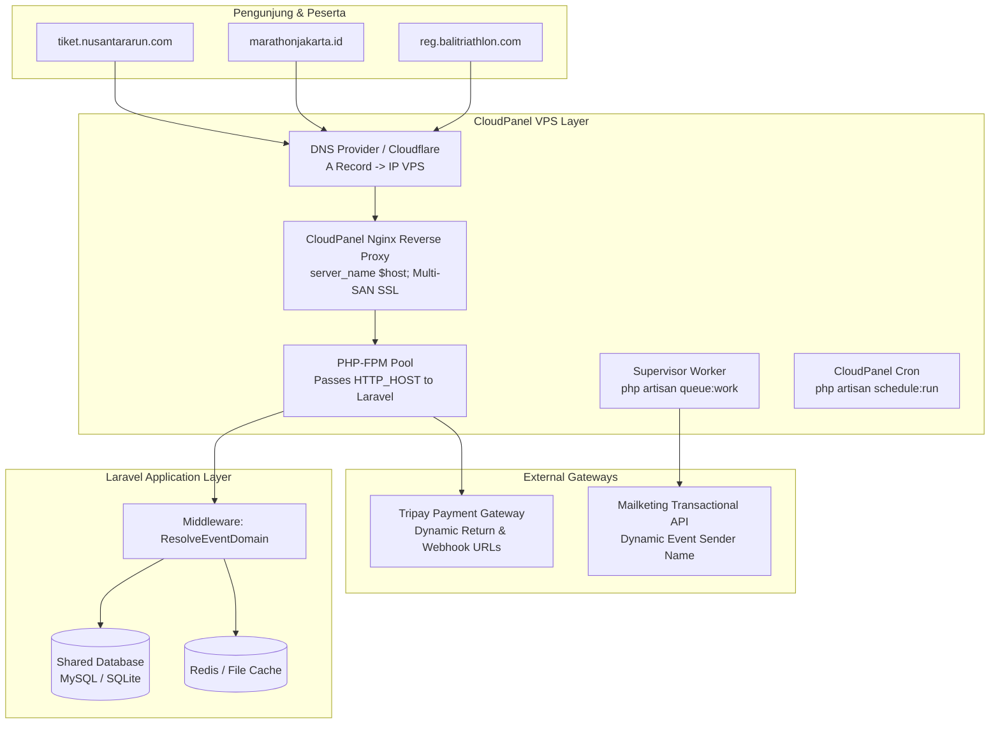
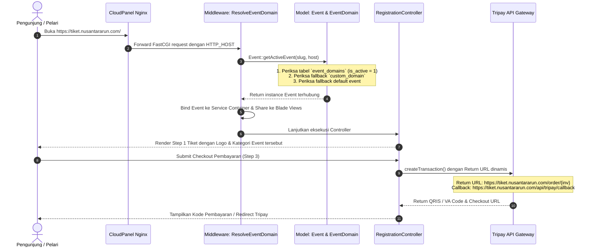
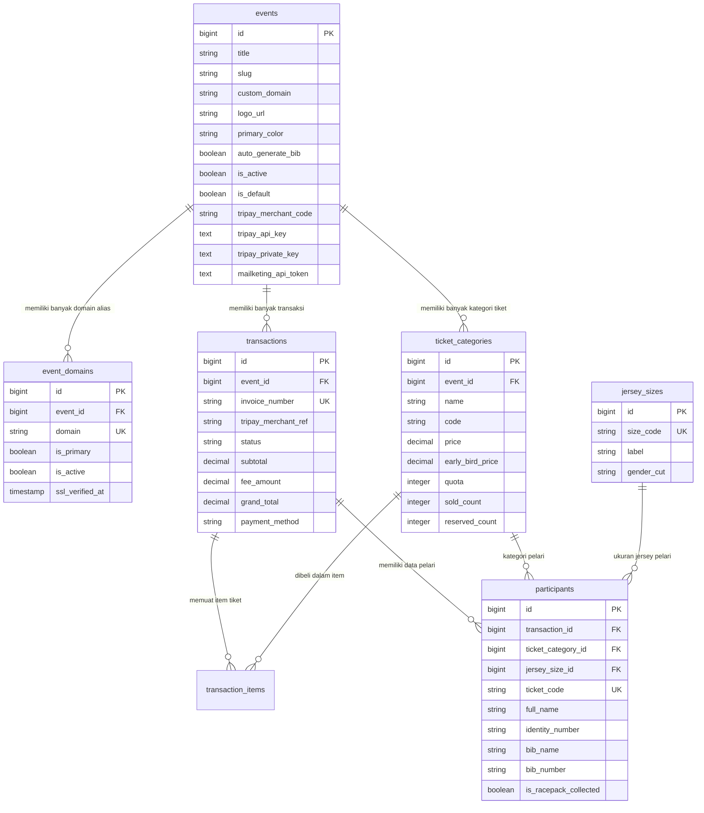

# RegRun Multi-Domain CloudPanel Architecture & Design Plan

Dokumen ini mendokumentasikan perencanaan arsitektur teknis (*technical design plan*), infrastruktur CloudPanel, skema database, alur data multi-domain, dan panduan operasional (*runbook*) untuk sistem pendaftaran event lari **RegRun**.

---

## 1. Arsitektur Infrastruktur CloudPanel (CloudPanel Infrastructure Architecture)

Platform RegRun dirancang dengan pola **Single Codebase, Multi-Tenant / Multi-Domain Architecture**. Seluruh domain dan subdomain event berjalan di atas 1 instalasi Laravel tunggal pada VPS yang dikelola oleh CloudPanel.



### 1.1. Spesifikasi Komponen CloudPanel

| Komponen | Implementasi di CloudPanel | Keterangan & Konfigurasi |
| :--- | :--- | :--- |
| **Site Type** | **PHP Site** | Dibuat via CloudPanel UI (`+ Add Site > Create a PHP Site`). |
| **Root Directory** | `/home/{user}/htdocs/{site}/public` | Nginx secara ketat menunjuk ke sub-folder `/public` Laravel. |
| **Nginx Virtual Host** | File `cloudpanel/nginx-vhost.conf` | Mendukung penambahan domain alias tanpa batas di tab *Domain Names*. FastCGI dikonfigurasi meneruskan `$host` dan `$scheme`. |
| **Sertifikat SSL** | **Let's Encrypt Multi-SAN** | Diterbitkan otomatis oleh CloudPanel untuk semua domain dan subdomain alias dalam satu sertifikat gabungan. |
| **PHP Runtime** | PHP 8.2 / 8.3 / 8.5 FPM | Opcache aktif, `memory_limit = 256M`, `max_execution_time = 180s`. |
| **Antrean (Queue)** | Supervisor (`regrun-worker`) | Menjalankan `php artisan queue:work` untuk pengiriman email Mailketing tanpa membebani thread pendaftaran. |
| **Scheduler (Cron)** | CloudPanel Cron Job | Menjalankan `php artisan schedule:run` setiap 1 menit untuk pelepasan kuota tiket kedaluwarsa. |

---

## 2. Alur Resolusi Multi-Domain (Domain Resolution Flow)

Setiap request HTTP yang masuk ke server diproses melalui diagram sekuens berikut:



---

## 3. Skema Database & Relasi Entitas (Database ERD)



---

## 4. Hirarki Kredensial & Kustomisasi Branding Event

Untuk memberikan fleksibilitas penuh bagi event organizer yang berbeda:

1. **Branding Visual**:
   - `events.logo_url`: Tampil di navbar publik, e-ticket pelari, dan header invoice.
   - `events.primary_color`: Warna tema tombol, badge, dan progress bar (default: `#ea580c`).
2. **Kredensial Gateway (Tripay & Mailketing)**:
   - **Tingkat Event**: Jika organizer memiliki akun Tripay atau Mailketing sendiri, admin dapat mengisi kolom `tripay_merchant_code` dan `tripay_api_key` langsung pada edit event.
   - **Tingkat Global (Fallback)**: Jika kolom pada event kosong, sistem otomatis menggunakan kredensial global di menu [Pengaturan Sistem](file:///Users/bangnahan/regrun/resources/views/admin/settings.blade.php).
3. **Pemisahan Skema Sandbox vs Produksi**:
   - Mode Sandbox menggunakan endpoint `https://tripay.co.id/api-sandbox/` dan kanal `QRIS2`.
   - Mode Produksi menggunakan endpoint `https://tripay.co.id/api/` dan kanal `QRIS` resmi dengan proteksi pemblokiran simulasi total (`403 Forbidden`).

---

## 5. Panduan Operasional CloudPanel (CloudPanel Runbook)

### 5.1. Menjalankan Domain Pertama (Inisialisasi)
1. **Create Site**: Di CloudPanel, klik **+ Add Site** > **Create a PHP Site**.
   - Domain: Masukkan domain pertama (misal: `regrun.portal.com` atau `tiket.nusantararun.com`).
   - PHP Version: `PHP 8.2` atau `PHP 8.3`.
2. **Setup Source Code & Environment**:
   ```bash
   su - <site-user>
   cd ~/htdocs/<domain-site>
   git clone <repo-url> .
   composer install --no-dev --optimize-autoloader
   cp .env.example .env
   php artisan key:generate
   ```
3. **Database Migration**:
   ```bash
   php artisan migrate --force
   php artisan db:seed --force
   ```
4. **Issue SSL**: Di CloudPanel, buka **Site > SSL/TLS > New Let's Encrypt Certificate > Create and Install**.

---

### 5.2. Menambahkan Domain Ke-2, Ke-3, ... Ke-N (Scaling Multi-Domain)

Ketika ada event baru yang ingin menggunakan domain mereka sendiri (misal: `marathonjakarta.id`):

1. **DNS Management**: Arahkan `A Record` domain baru ke **IP Server CloudPanel Anda**.
2. **CloudPanel Site Alias**:
   - Masuk ke CloudPanel > Pilih Site aplikasi RegRun Anda.
   - Buka tab **Domain Names**.
   - Masukkan domain baru: `marathonjakarta.id` (dan `www.marathonjakarta.id` jika perlu).
   - Klik **Add Domain**.
3. **Update SSL Let's Encrypt**:
   - Buka tab **SSL/TLS**.
   - Klik **New Let's Encrypt Certificate**, pastikan domain baru tercentang, klik **Create and Install**.
4. **Hubungkan di Panel Admin RegRun**:
   - Buka menu **Manajemen Event** di browser: `https://[domain-anda]/admin/events`.
   - Pada kartu event yang bersangkutan, di bagian **Domain & Subdomain Terhubung**, masukkan nama domain: `marathonjakarta.id`.
   - Centang **Jadikan Domain Utama**, lalu klik **Hubungkan Domain**.

Seketika domain `marathonjakarta.id` aktif dan langsung menampilkan halaman pendaftaran event tersebut secara independen!

---

## 6. Berkas Pendukung Infrastruktur di Repositori

Repositori ini telah dilengkapi dengan berkas-berkas siap pakai di folder `cloudpanel/`:

1. [nginx-vhost.conf](file:///Users/bangnahan/regrun/cloudpanel/nginx-vhost.conf): Template Nginx virtual host CloudPanel dengan FastCGI host passthrough, Gzip, static asset caching, dan security headers.
2. [cloudpanel-deploy.sh](file:///Users/bangnahan/regrun/cloudpanel/cloudpanel-deploy.sh): Skrip CI/CD deployment otomatis untuk maintenance mode, git pull, composer install, migration, dan cache warmup.
3. [supervisor-worker.conf](file:///Users/bangnahan/regrun/cloudpanel/supervisor-worker.conf): Konfigurasi supervisor queue worker CloudPanel untuk pengiriman email asinkron.
4. [cron-schedule.txt](file:///Users/bangnahan/regrun/cloudpanel/cron-schedule.txt): Jadwal cron CloudPanel untuk task scheduler Laravel.
5. [domain-setup-guide.md](file:///Users/bangnahan/regrun/cloudpanel/domain-setup-guide.md): Panduan ringkas administrator untuk menghubungkan domain baru di CloudPanel.
